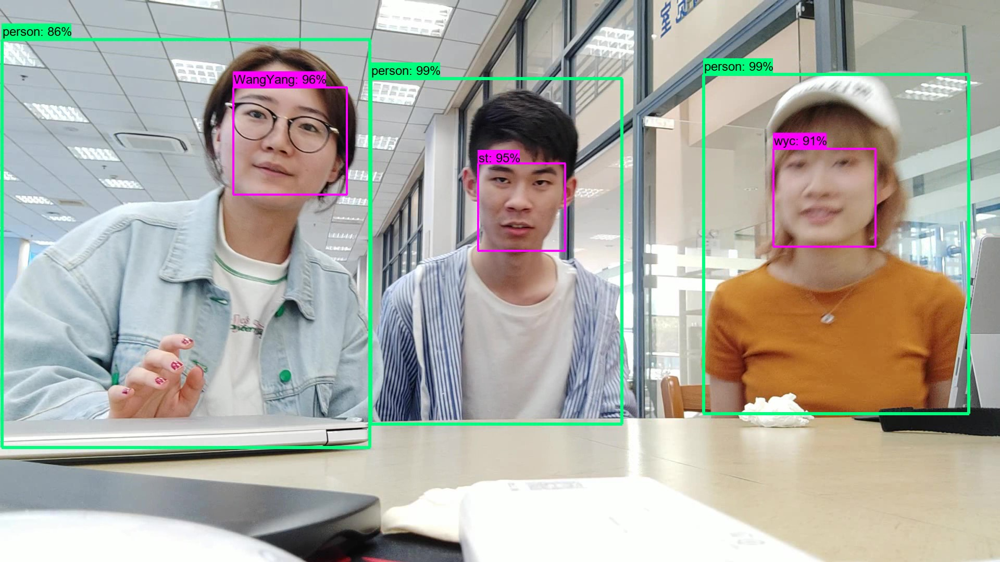
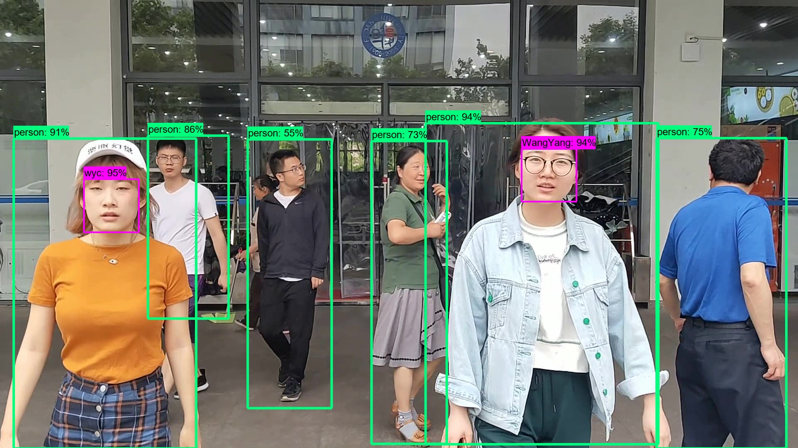
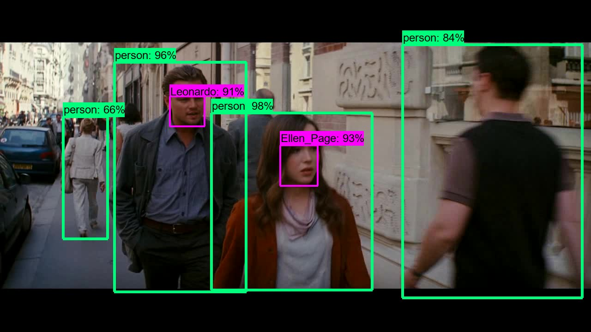

# Realtime Face&Object Detection
## 部署及运行结果

### 环境配置

运行环境：Windows 10 + CUDA 10.0 + CUDNN 7.1 + Python 3.7 +  MySQL 8.0.16

包依赖：

- tensorflow-gpu 1.13
- opencv 4.1
- numpy 1.16
- scikit-learn 0.21rc2
- scipy 1.3.0rc1
- Pillow 6.0
- requests 2.18.4
- PyMySQL 0.9.3

`pip install -r requirements.txt`安装依赖包

## 代码目录结构说明

├── README.md                               // help

├── core                                             // 检测核心调用

│   └── baidu_aip                              // baidu_AI调用类

│       ├── base.py                              // 请求基类

│       └── face.py                               // 人脸识别调用类

│   ├── aip_multisearch.py              // baidu_AI M：N人脸搜索并可视化

│   ├── detect.py                               // 检测进程

│   ├── insightface_recognizer.py  // Insightface人脸识别

│   ├── tf_operation.py                    // tensorflow目标检测操作

│   ├── webcam.py                           // 输入摄像头类

├── input                                           // 输入视频文件夹

├── mtcnn_insightface                    // MTCNN & Insightface人脸检测

│   ├── core                                       // 检测模型核心

│       ├── MTCNN                             // MTCNN模型操作

│       ├── Arcface_model.py           // Arcface模型操作

│       ├── model_util.py                  // 模型工具类

│       ├── ResNet_v2.py                  // ResNet_v2模型

│       ├── ResNet_v2_ri.py             // ResNet_v2_ri模型

│       └── tool.py                             // 图像处理工具

│   ├── data                                     // embeding数据保存文件夹

│   ├── model                                 // 模型文件夹

│       ├── Arcface_model               // Arcface模型

│       └── MTCNN_model               // MTCNN三层模型

│   └── recognizer                           // 人脸识别器

│       ├── arcface_recognizer.py   // Arcface人脸识别器

│       └── recognizer.py                 // 人脸识别器基类

├── object_detection                    // tensorflow目标检测模型

│   ├── core                                    // 检测模型核心

│   ├── data                                    // 标签文件

│   ├── protos                                // google protobuf文件

│   ├── ssd_mobilenet_v2_coco  // ssd_mobilenet模型 

│   └── utils                                    // 可视化工具类

├── output                                     // 输出视频文件夹

├── config.py                                 // 配置文件

├── realtime_detect.py                // 实时检测主程序

├── requirements.txt                   // 依赖库说明文件

├── video_detect.py                     // 视频检测主程序

└── video_detect_multi.py          // 多进程视频检测主程序

## 运行说明

- 执行 realtime_detect.py 开始实时视频检测，修改配置文件中的视频源可部署在服务端检测rtmp流
- 执行 video_detect.py 或 video_detect_multi.py 执行视频检测
## Interface overview

> Baidu_AI

- multiSearch：执行 M：N 人脸搜索请求
- addUser：人脸注册
- updateUser：人脸更新
- faceDelete：人脸删除
- aip_msearch：读入 image_np，执行 M：N 人脸搜索，将结果可视化在 frame 上

------

Insightface：

> Basic interface：

- get_embd：获得 512 维特征向量
- align_face：人脸对齐
- recognize：人脸识别接口，输出识别结果和人脸框

> Extended interface：

- add_customs：增加人脸到数据库
- add_embds：更新人脸特征数据
- update_customs：更新指定人的人脸数据
- del_customs：删除人脸

> app interface：

- insight_recognize：读入 image_np，执行 Insightface recognize，将结果可视化在 frame 上

------

> tensorflow 目标检测

- load_graph：载入模型
- od_detect：读入 image_np，执行目标检测，将结果可视化在 frame 上

## 部分结果展示

